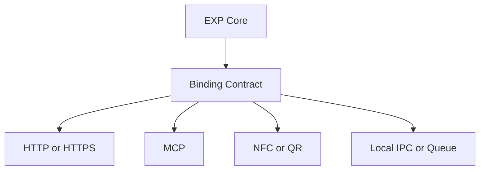

# EXP transport bindings

EXP is a protocol for trusted, purpose-bound data exchange. It does not require one network
transport. The core contracts define what is exchanged and how it is authorized; a binding defines
how a carrier delivers it.

## Core boundary

The transport binding describes an adapter-level request with:

- message and operation identity;
- sender and optional recipient binding;
- nonce and lifecycle timestamps;
- opaque payload bytes;
- optional protocol signature;
- adapter-controlled replay, trust resolution, deadlines, and cancellation;
- normalized responses and stable error metadata.

Carrier metadata is deliberately separate. An HTTP header, MCP field, NFC record, queue envelope,
or local process identifier is not trusted merely because a binding exposes it. If a value affects
authorization or signature verification, it must be included in the signed EXP input.

These interfaces do not replace existing v0.1 wallet, trust, catalog, or standing records. They
provide a common seam for carrying those records while preserving their existing signature and
consent rules.

## Binding responsibilities

Every binding should define:

1. How it encodes and decodes the opaque EXP payload.
2. How it carries or derives the message identifier and nonce.
3. How it preserves sender, recipient, audience, and expiry semantics.
4. How it reports delivery failure, replay, rejection, and timeout.
5. How it prevents carrier caches or diagnostics from retaining sensitive payloads.
6. How it maps cancellation and deadlines to its local runtime.

Bindings must not silently broaden scopes, extend expirations, reuse nonces, or reinterpret a
purpose-bound presentation.

## MCP adapter

MCP is an optional agent-facing binding. An MCP server may expose operations such as requesting a
wallet presentation or delivering an authorized EXP view. The MCP layer can provide tool/resource
discovery and agent orchestration, while EXP remains responsible for:

- wallet approval;
- audience and nonce binding;
- signature verification;
- scope and operation narrowing;
- expiry and revocation;
- provenance and consent receipts.

An MCP implementation must not treat an agent's tool access as proof that the agent is authorized
to receive a person's data. It must invoke the EXP authorization flow.

## HTTP adapter

HTTP/HTTPS is an optional carrier binding. Existing HTTP-shaped conformance cases cover signed
method/path/body transport and external HTTPS policy. They are labeled `transport:http` in the
conformance report and do not define the core adapter contract.

An HTTP implementation should use `no-store` for sensitive exchanges, redact bodies from logs,
preserve request IDs and retry metadata, and bind any endpoint/audience claim into the signed EXP
record rather than relying on a URL alone.

## NFC, QR, and local bindings

NFC or QR is suitable for rendezvous: it can transfer a short-lived session identifier, challenge,
or endpoint reference. It should not be treated as a trusted bulk-data channel. The wallet must
still verify the recipient, obtain user approval, and create an audience-bound EXP presentation.

Local IPC, Bluetooth, WebSocket, and queues can use the same contracts. Their proximity or private
network location does not remove the need for signatures, replay protection, consent, or expiry.

## Conformance levels

- `core`: canonical bytes, signatures, schemas, semantic rules, wallet policy, trust lifecycle,
  and standing state behavior. Selected with `--profile core`.
- `transport:http`: HTTP-shaped signed delivery and HTTPS policy. Selected with `--profile http`.
- Future profiles such as `transport:mcp` or `transport:nfc`: binding-specific encoding and
  lifecycle behavior, added without changing core vectors.

A passing profile report is self-conformance evidence for the named cases, not certification of the
carrier, deployment, or operator.
